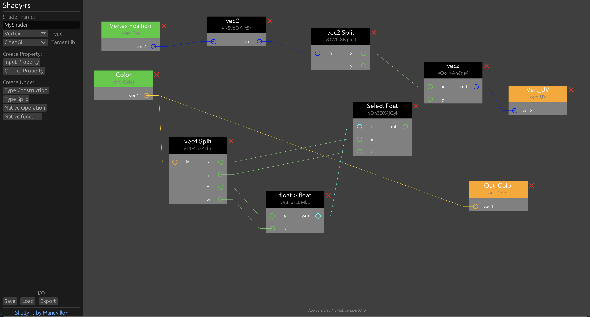

# shady-rs

A Shader Graph made in Rust

> This is still a work in progress

## TODO List

- [ ] Presets (Unity, bevy)
- [ ] Dynamic material editing
- [ ] GLSL for OpenGL ES and OpenGL (latest version for now)
- [ ] Material preview (rotating Sphere)